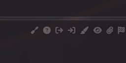
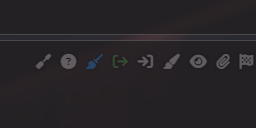
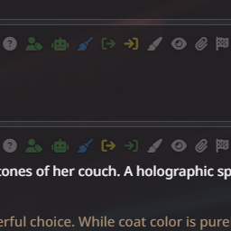
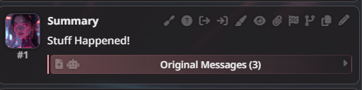

# Inline Summary — a SillyTavern Extension

## AI Disclaimer
The code for this extension was AI-generated, then manually edited and refactored so the final result is around 65% AI. 
I'm a C++ programmer, and this is my first time touching JavaScript, hence the vibecoding. 

## What does it do?
This is a simple Summary/Memory extension. It allows you to select a range of messages in chat and summarise them using an LLM or manually. It then replaces the selected range with a summary message. 
The original messages are stored away and hidden, but can be restored at any time. 

## Usage
#### Making a new Summary
Select a **Start** (  ) and an **End** (  ) message using the two Message Action buttons. 
 
 
Then the options for **AI Summary** (  ), **Manual Summary** (  ), and **Clear Range** (  ) will appear. 
 
Click the **AI Summary** button and wait for the AI to finish generating. 
Alternatively click the **Manual Summary** button, then edit the inserted message and write a manual summary. 

#### Existing Summary
Summary messages will contain an expandable header which contains the original messages. Click anywhere on the header (except the buttons) to expand it. 
 
The **Restore Original and Delete Summary** (  ) button will detele the summary and restore the original messages. 
The **Re-Summarise (AI)** (  ) will regenerate a new summary using the stored original messages.

## How does it work?
When a range is selected, the extension creates a new empty summary message and inserts it into the chat. 
The selected messages are stored in the `extra` data field of the new summary message. 
A summary prompt is generated by taking the main summary prompt and adding a specified number of earlier messages for context (or the entire history if the setting is `-1`). The context is wrapped with Start/End markers as defined in the settings. 
A mid-prompt is appended (also defined in the settings). 
The messages to be summarised are then added, also wrapped in Start/End markers. 
A end-prompt is appended (also defined in the settings). 
This complete prompt is sent to the LLM using the current connection profile or a specific profile if the option is enabled. 
Once the LLM is done, the contents of the summary message are replaced with the response. The chat is saved and refreshed. 
When the **Restore** button is pressed, the summary message is deleted and the original messages are reinserted into the chat. 

## FAQ

_**Can I edit the summary?**_ 
Yes! They behave like any other message.

_**Can summary messages be summarised?**_ 
Yes. Nested summaries are supported. When summarising a summary message, the summary text will be used, **not** the original messages

_**What happens during chat exports?**_ 
If exported as JSON, the original messages will be in the file. 
When exported as plain text, only the summary messages will be exported.

_**Are swipes supported on summary messages?**_ 
No. It shouldn’t break, but swipes will behave like regular message swipes without any awareness of the summary or the original messages attached to it.

_**Is it compatible with extension X?**_ 
No idea. This extension directly manipulates chat and stores/restores messages without altering them. As long as other extensions are okay with that, it *should* be compatible — but no promises.

_**Can I select a specific Connection Profile/Chat Completion Preset for the summary?**_ 
Yes. Since v1.0.2 
⚠ Warning: Any unsaved changes to `Connection Profile` or `Chat Completion Preset` or `AI Reponse Template` will be lost during profile change.

_**Has anyone actually asked these questions?**_ 
Yes, the Connection Profile one.

## Known Incompatibilities

_**Chat Style - Document**_ 
This specific style hides the Message Actions buttons from older messages, which also removes the buttons added by this extension. Bubbles and Flat styles do work. 
_**Text Completion**_ 
In text completion mode `Connection Profile` or `Chat Completion Preset` are not supported and might create odd results. 
`Chat Completion Preset` option shows a list of numbers when Text Completion mode is active. Swapping to chat completion and refreshing the page should fix it. 

## Changelog

#### v1.0.11
Fixed `Original Messages` not appearing on chat messages when after they were hidden by the visible message limit. 
Added `/ils-sumarise` command. Usage: ``/ils-sumarise x y` or `/ils-sumarise manual=[true|false] x y` where x and y are start and stop message indices; `manual` mode inserts an placeholder summary message instead of using LLM. 
Changed error messages to use toast popups.

### Previous Changes
See `changelog.md`
